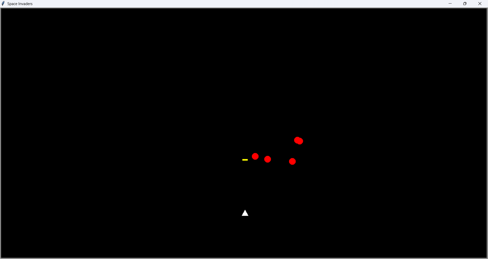

# 🚀 Space Invaders Game (Python Turtle)

This is a simple Space Invaders-style arcade game built using Python Turtle graphics. The player controls a spaceship, shoots bullets, and destroys incoming enemies.

---

## 🎮 Features

- Move spaceship left and right
- Shoot bullets using spacebar
- Multiple enemies moving downward
- Collision detection
- Game Over message on screen

---

## 🕹️ Controls

- ⬅️ Left Arrow → Move Left  
- ➡️ Right Arrow → Move Right  
- 🔫 Spacebar → Shoot  

---

## 🛠️ Technologies Used

- Python  
- Turtle Graphics  

---

## 📸 Screenshot

---

## ▶️ How to Run

1. Install Python (if not installed)
2. Download or clone this repository
3. Open the project in PyCharm or any IDE
4. Run `main.py`

---

## 📚 What I Learned

- Game loop logic  
- Collision detection  
- Handling keyboard inputs  
- Using Turtle for game development
